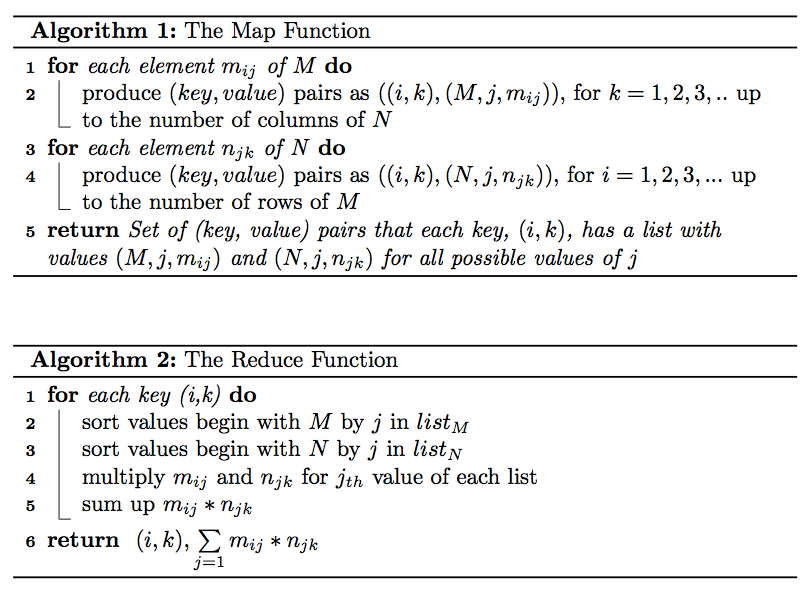

# Hadoop Matrix Multiplication

## Resources used:
- [Sparse Matrix Multiplication with Hadoop](https://github.com/marufaytekin/MatrixMultiply)
- [Hadoop Matrix Multiplication](https://stackoverflow.com/questions/9708427/hadoop-matrix-multiplication)
- [Matrix-Multiplication](https://github.com/studhadoop/Matrix-Multiplication)
- [Develop Java MapReduce programs for Apache Hadoop](https://learn.microsoft.com/en-us/azure/hdinsight/hadoop/apache-hadoop-develop-deploy-java-mapreduce-linux)
- [Hadoop & Mapreduce Examples: Create First Program in Java](https://www.guru99.com/create-your-first-hadoop-program.html)

## Algorithm



## Input/Output

### Matrix M

```
 M,0,0,10.0
 M,0,2,9.0
 M,0,3,9.0
 M,1,0,1.0
 M,1,1,3.0
 M,1,2,18.0
 M,1,3,25.2
 ....
 ```

### Matrix N

```
 N,0,0,1.0
 N,0,2,3.0
 N,0,4,2.0
 N,1,0,2.0
 N,3,2,-1.0
 N,3,6,4.0
 N,4,6,5.0
 N,4,0,-1.0
 ....
 ```

## Usage

1. Compile jar using `mvn clean package`
2. Copy jar to your container filesystem: `docker cp target/HadoopMatrixMultiplication-1.0-SNAPSHOT.jar <container_id>:/tmp`
3. Copy input to hdfs folder. Sample input can be found in `./input` folder (but be aware that expected matrix size is hardcoded). 
4. Run your job: `hadoop jar HadoopMatrixMultiplication-1.0-SNAPSHOT.jar MatrixMultiplicationRunner <input> <output>`